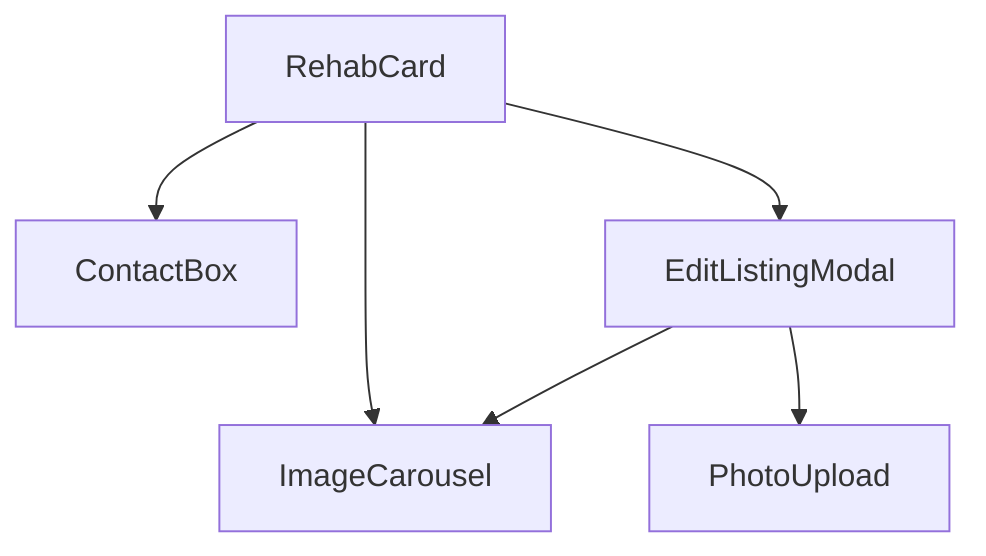
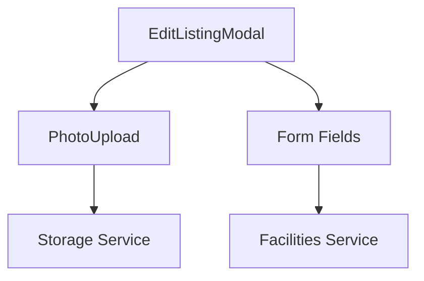

# Key Components Documentation

## Overview
The Recovery Directory platform uses a component-based architecture with several key components that handle different aspects of the application. This document details the main components and their interactions.

## Core Components

### RehabCard
Primary component for displaying facility information.

#### Features
- Responsive layout
- Verification badge
- Photo display
- Action buttons
- Status indicators

#### Props
```typescript
interface RehabCardProps {
  facility: Facility;
  onEdit?: (facility: Facility) => void;
}
```

#### Usage
```tsx
<RehabCard 
  facility={facility}
  onEdit={handleEdit}
/>
```

### ImageCarousel
Handles photo display with different behaviors based on verification status.

#### Features
- Slideshow for verified listings
- Single photo for unverified
- Touch navigation
- Responsive design
- Progress indicators

#### Props
```typescript
interface ImageCarouselProps {
  images: string[];
  showNavigation?: boolean;
  onImageClick?: () => void;
  paginationPosition?: 'bottom' | 'elevated';
  isVerified?: boolean;
}
```

#### Usage
```tsx
<ImageCarousel 
  images={facility.images}
  showNavigation={facility.images.length > 1}
  isVerified={facility.isVerified}
/>
```

### EditListingModal
Modal component for editing facility information.

#### Features
- Form validation
- Photo management
- Real-time updates
- Error handling
- Status preservation

#### Props
```typescript
interface EditListingModalProps {
  facility: Facility;
  isOpen: boolean;
  onClose: () => void;
  onSave: (data: Partial<Facility>) => Promise<void>;
}
```

#### Usage
```tsx
<EditListingModal
  facility={editingFacility}
  isOpen={isModalOpen}
  onClose={handleClose}
  onSave={handleSave}
/>
```

### ContactBox
Displays facility contact information and actions.

#### Features
- Contact buttons
- Verification status
- Upgrade prompt
- Contact form
- Social links

#### Props
```typescript
interface ContactBoxProps {
  facility: Facility;
}
```

#### Usage
```tsx
<ContactBox facility={facility} />
```

## Component Interactions

### Listing Flow


### Edit Flow


## Component Guidelines

### State Management
- Use local state for UI
- Use Zustand for global state
- Handle async operations
- Manage loading states

### Error Handling
- Form validation
- API errors
- Upload errors
- Network issues
- User feedback

### Accessibility
- ARIA labels
- Keyboard navigation
- Screen reader support
- Focus management
- Color contrast

## Best Practices

### Component Design
1. Single Responsibility
   - Each component has a specific purpose
   - Clear interfaces
   - Minimal dependencies

2. Composition
   - Use component composition
   - Share common logic
   - Maintain flexibility

3. Performance
   - Optimize renders
   - Lazy loading
   - Memoization
   - Code splitting

### Props
1. Required vs Optional
   - Mark required props
   - Provide defaults
   - Use TypeScript

2. Validation
   - Type checking
   - Runtime validation
   - Error boundaries

### State
1. Local vs Global
   - Use local when possible
   - Share through context
   - Global for app state

2. Updates
   - Batch updates
   - Optimize renders
   - Handle side effects

## Testing

### Unit Tests
```typescript
describe('RehabCard', () => {
  it('shows verified badge when verified', () => {
    render(<RehabCard facility={verifiedFacility} />);
    expect(screen.getByText('Verified')).toBeInTheDocument();
  });
});
```

### Integration Tests
```typescript
describe('EditListingModal', () => {
  it('saves changes and updates display', async () => {
    render(<EditListingModal facility={facility} />);
    // Test edit flow
  });
});
```

## Common Patterns

### Loading States
```tsx
{loading ? (
  <LoadingSpinner />
) : (
  <ComponentContent />
)}
```

### Error Handling
```tsx
{error ? (
  <ErrorMessage message={error} />
) : (
  <ComponentContent />
)}
```

### Conditional Rendering
```tsx
{facility.isVerified && (
  <VerifiedFeatures />
)}
```

## Future Improvements
1. Component library
2. Storybook integration
3. Performance monitoring
4. Enhanced accessibility
5. Animation system
6. Theme customization
7. Enhanced error handling
8. Better loading states
9. More test coverage
10. Documentation updates
