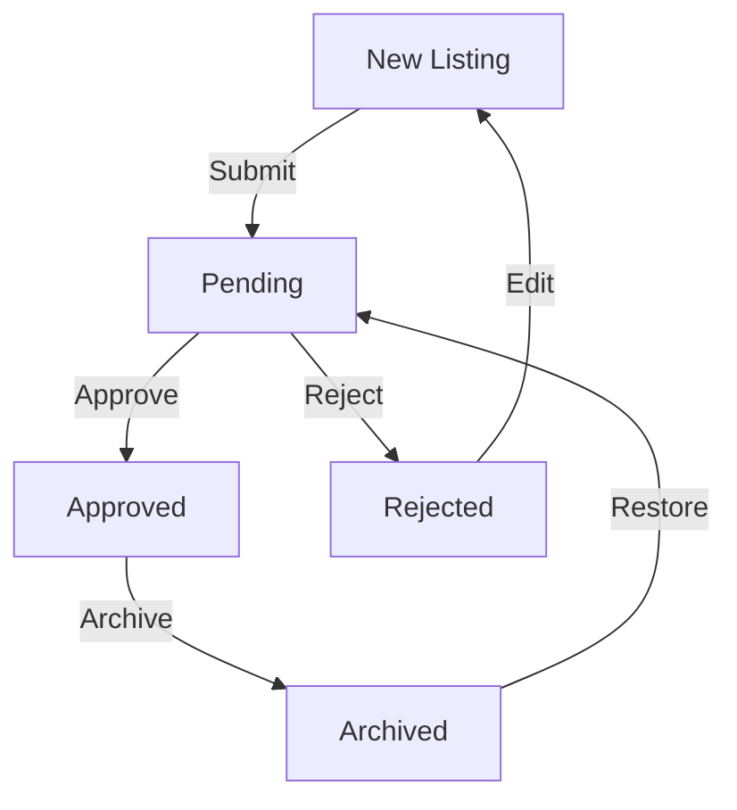

# Content Moderation System Documentation

## Overview
The Recovery Directory platform implements a comprehensive moderation system to ensure listing quality and compliance. This document details the moderation workflow and implementation.

## Moderation Statuses

### Status Types
```typescript
type ModerationStatus = 'pending' | 'approved' | 'rejected' | 'archived';
```

### Status Definitions
1. Pending
   - New or edited listings
   - Awaiting review
   - Limited visibility

2. Approved
   - Reviewed and accepted
   - Fully visible
   - Active in search

3. Rejected
   - Failed review
   - Not visible
   - Requires changes

4. Archived
   - Inactive listings
   - Historical record
   - Can be restored

## Moderation Flow



## Implementation

### Database Schema
```typescript
interface Facility {
  id: string;
  moderationStatus: ModerationStatus;
  moderationNotes?: string;
  lastReviewedAt?: Date;
  reviewedBy?: string;
}
```

### Status Updates
```typescript
async function updateModerationStatus(
  facilityId: string,
  status: ModerationStatus,
  notes?: string
) {
  await db.facilities.update(facilityId, {
    moderationStatus: status,
    moderationNotes: notes,
    lastReviewedAt: new Date(),
    reviewedBy: auth.currentUser.id
  });
}
```

## Admin Interface

### Moderation Queue
- List of pending listings
- Quick review actions
- Batch operations
- Filter and sort

### Review Interface
- Facility details
- Content validation
- Image review
- Action buttons

### Moderation History
- Review timeline
- Status changes
- Reviewer notes
- Action log

## User Interface

### Status Indicators
- Status badges
- Visibility states
- Action prompts
- Help messages

### Edit Flow
- Status preservation
- Change tracking
- Review triggers
- User feedback

## Moderation Rules

### Content Guidelines
1. Accurate Information
   - Verify contact details
   - Check location data
   - Validate services
   - Review credentials

2. Image Standards
   - Professional quality
   - Relevant content
   - No text overlays
   - Proper formatting

3. Description Requirements
   - Clear services
   - Accurate details
   - Professional tone
   - No spam/ads

4. Contact Information
   - Valid phone
   - Active email
   - Real address
   - Working website

## Security

### Access Control
- Admin only moderation
- Role verification
- Action logging
- Change tracking

### Data Protection
- Secure storage
- Access logs
- Change history
- Backup system

## Notifications

### Admin Notifications
- New submissions
- Edit requests
- Report alerts
- Queue updates

### User Notifications
- Status changes
- Review results
- Required actions
- System messages

## Reporting System

### Report Types
1. Inaccurate Information
2. Inappropriate Content
3. Spam/Advertising
4. Policy Violation

### Report Flow
```typescript
interface Report {
  facilityId: string;
  reportType: ReportType;
  description: string;
  status: 'pending' | 'reviewed' | 'resolved';
  createdAt: Date;
}
```

## Best Practices

### Review Process
1. Consistent criteria
2. Thorough checks
3. Clear documentation
4. Quick response
5. Fair decisions

### Communication
1. Clear feedback
2. Helpful guidance
3. Timely responses
4. Professional tone

### Quality Control
1. Regular audits
2. Performance metrics
3. Review consistency
4. Process improvement

## Troubleshooting

### Common Issues
1. Stuck in review
2. Status mismatch
3. Update failures
4. Notification issues

### Solutions
1. Check queue
2. Verify status
3. Review logs
4. Reset notifications

## Monitoring

### Metrics
- Queue length
- Response time
- Approval rate
- Report volume

### Analytics
- Status distribution
- Review timeline
- Common issues
- User feedback

## Future Improvements
1. AI assistance
2. Automated checks
3. Bulk moderation
4. Enhanced reporting
5. Better analytics
6. User appeals
7. Review delegation
8. Training system
9. Process automation
10. Performance optimization
