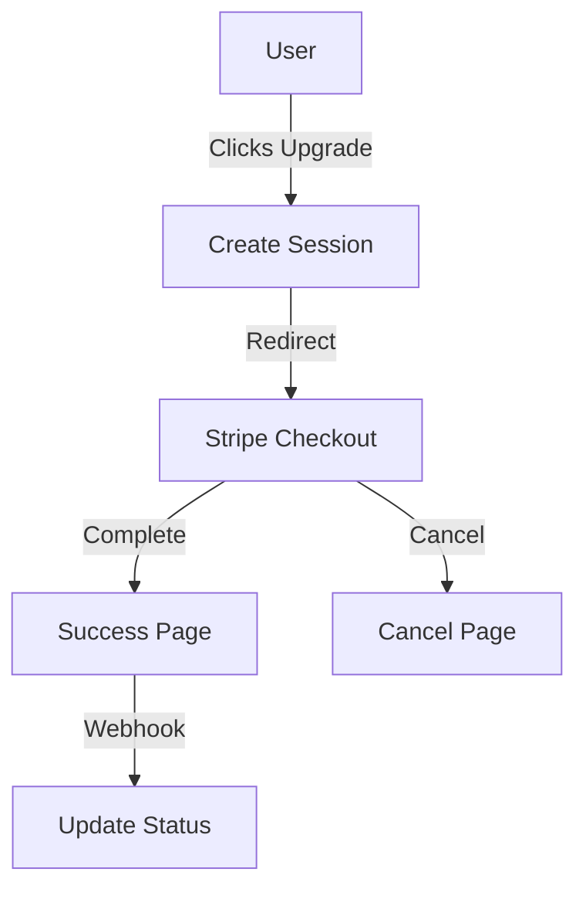

# Payment System Documentation

## Overview
The Recovery Directory platform uses Stripe for handling subscription payments for verified listings. This document details the payment system implementation and integration.

## Payment Flow

### Upgrade Process
1. User clicks "Upgrade to Verified"
2. Stripe Checkout session created
3. User completes payment
4. Webhook processes payment
5. Facility status updated



## Stripe Integration

### Configuration
```typescript
// Stripe initialization
const stripe = new Stripe(process.env.STRIPE_SECRET_KEY);
```

### Environment Variables
```env
VITE_STRIPE_PUBLIC_KEY=pk_test_...
VITE_STRIPE_PRICE_ID=price_...
STRIPE_SECRET_KEY=sk_test_...
STRIPE_WEBHOOK_SECRET=whsec_...
```

## Components

### Payment Button
```typescript
interface PaymentButtonProps {
  facilityId: string;
  onSuccess?: () => void;
}
```

### Success Page
- Handles successful payments
- Shows confirmation
- Updates facility status
- Redirects to dashboard

### Cancel Page
- Handles cancelled payments
- Returns to upgrade flow
- Preserves facility state
- Shows helpful message

## Server Implementation

### Create Checkout Session
```typescript
export async function createCheckoutSession(
  facilityId: string,
  customerId?: string
) {
  const session = await stripe.checkout.sessions.create({
    mode: 'subscription',
    payment_method_types: ['card'],
    line_items: [{
      price: process.env.STRIPE_PRICE_ID,
      quantity: 1
    }],
    metadata: {
      facilityId
    },
    success_url: '${YOUR_DOMAIN}/payment/success?session_id={CHECKOUT_SESSION_ID}',
    cancel_url: '${YOUR_DOMAIN}/payment/cancel'
  });
  
  return session;
}
```

### Webhook Handler
```typescript
export async function handleWebhook(
  request: Request,
  signature: string
) {
  const event = stripe.webhooks.constructEvent(
    request.body,
    signature,
    process.env.STRIPE_WEBHOOK_SECRET
  );
  
  switch (event.type) {
    case 'checkout.session.completed':
      await handleSuccessfulPayment(event.data.object);
      break;
    case 'customer.subscription.deleted':
      await handleCancelledSubscription(event.data.object);
      break;
  }
}
```

## Database Schema

### Subscription
```typescript
interface Subscription {
  id: string;
  facilityId: string;
  customerId: string;
  status: 'active' | 'cancelled' | 'past_due';
  currentPeriodEnd: Date;
  createdAt: Date;
  updatedAt: Date;
}
```

### Facility Updates
```typescript
interface FacilityPayment {
  subscriptionId: string;
  isVerified: boolean;
  verifiedUntil: Date;
}
```

## Error Handling

### Payment Errors
1. Invalid card
2. Insufficient funds
3. Network issues
4. Session expiration

### Webhook Errors
1. Signature verification
2. Event processing
3. Database updates
4. Status synchronization

## Security

### Payment Security
- Stripe Elements
- HTTPS only
- Secure webhook
- Data encryption

### Access Control
- User authentication
- Role verification
- Session validation
- Rate limiting

## Testing

### Test Cards
```plaintext
Success: 4242 4242 4242 4242
Decline: 4000 0000 0000 0002
3D Secure: 4000 0000 0000 3220
```

### Test Webhooks
```bash
stripe listen --forward-to localhost:3000/webhook
```

### Test Cases
1. Successful payment
2. Failed payment
3. Subscription cancellation
4. Webhook handling
5. Status updates

## Monitoring

### Payment Metrics
- Success rate
- Conversion rate
- Average value
- Churn rate

### Error Tracking
- Payment failures
- Webhook errors
- System errors
- User errors

## Best Practices

### Implementation
1. Use Stripe Elements
2. Implement proper error handling
3. Validate webhooks
4. Monitor transactions
5. Handle edge cases

### Security
1. Use HTTPS
2. Validate signatures
3. Secure credentials
4. Monitor activity
5. Regular audits

### User Experience
1. Clear pricing
2. Simple flow
3. Good feedback
4. Error messages
5. Success confirmation

## Troubleshooting

### Common Issues
1. Payment declined
2. Webhook failures
3. Status sync issues
4. Session timeouts

### Solutions
1. Check card details
2. Verify webhook setup
3. Check logs
4. Validate configuration
5. Test connectivity

## Future Improvements
1. Multiple plans
2. Trial periods
3. Promo codes
4. Better analytics
5. Enhanced reporting
6. Automated refunds
7. Subscription management
8. Payment methods
9. Invoice customization
10. Enhanced security
