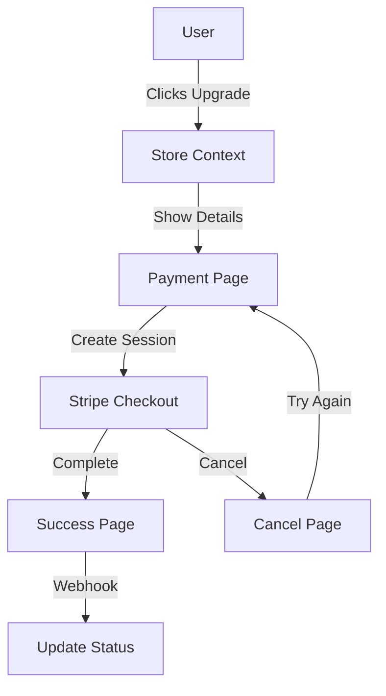

# Payment System Documentation

## Overview
The Recovery Directory platform uses Stripe for handling subscription payments for verified listings. This document details the payment system implementation and integration.

## Payment Flow

### Upgrade Process
1. User clicks "Upgrade to Verified" on facility card
2. System stores facility context in sessionStorage
3. Payment page displays facility name and details
4. Stripe Checkout session created
5. User completes payment
6. Webhook processes payment
7. Facility status updated



## State Management

### Facility Context
```typescript
interface FacilityContext {
  facilityId: string;
  facility: {
    id: string;
    name: string;
    // other facility data
  };
}
```

### Session Storage
```typescript
// Store facility data
sessionStorage.setItem('facilityData', JSON.stringify({
  facilityId,
  facility
}));

// Retrieve facility data
const facilityData = JSON.parse(
  sessionStorage.getItem('facilityData') || '{}'
);
```

## Stripe Integration

### Configuration
```typescript
// Stripe initialization
const stripe = new Stripe(process.env.STRIPE_SECRET_KEY);
```

### Environment Variables
```env
VITE_STRIPE_PUBLIC_KEY=pk_test_...
VITE_STRIPE_PRICE_ID=price_...
STRIPE_SECRET_KEY=sk_test_...
STRIPE_WEBHOOK_SECRET=whsec_...
```

## Components

### Payment Page
- Shows facility name and details
- Displays subscription price
- Handles payment initiation
- Preserves facility context
- Shows loading states

### Success Page
- Handles successful payments
- Shows confirmation
- Updates facility status
- Redirects to dashboard
- Cleans up session data

### Cancel Page
- Handles cancelled payments
- Shows facility name
- Provides "Try Again" option
- Returns to payment page with context
- Offers account navigation
- Preserves facility state

## Server Implementation

### Create Checkout Session
```typescript
export async function createCheckoutSession(
  facilityId: string,
  customerId?: string
) {
  const session = await stripe.checkout.sessions.create({
    mode: 'subscription',
    payment_method_types: ['card'],
    line_items: [{
      price: process.env.STRIPE_PRICE_ID,
      quantity: 1
    }],
    metadata: {
      facilityId
    },
    success_url: '${YOUR_DOMAIN}/payment/success?session_id={CHECKOUT_SESSION_ID}',
    cancel_url: '${YOUR_DOMAIN}/payment/cancel'
  });
  
  return session;
}
```

### Webhook Handler
```typescript
export async function handleWebhook(
  request: Request,
  signature: string
) {
  const event = stripe.webhooks.constructEvent(
    request.body,
    signature,
    process.env.STRIPE_WEBHOOK_SECRET
  );
  
  switch (event.type) {
    case 'checkout.session.completed':
      await handleSuccessfulPayment(event.data.object);
      break;
    case 'customer.subscription.deleted':
      await handleCancelledSubscription(event.data.object);
      break;
  }
}
```

## Database Schema

### Subscription
```typescript
interface Subscription {
  id: string;
  facilityId: string;
  customerId: string;
  status: 'active' | 'cancelled' | 'past_due';
  currentPeriodEnd: Date;
  createdAt: Date;
  updatedAt: Date;
}
```

### Facility Updates
```typescript
interface FacilityPayment {
  subscriptionId: string;
  isVerified: boolean;
  verifiedUntil: Date;
}
```

## Navigation Flow

### Payment Initiation
1. Store facility context in sessionStorage
2. Navigate to payment page
3. Display facility details
4. Initialize Stripe

### Payment Cancellation
1. Preserve facility context
2. Show facility name
3. Offer retry option
4. Provide account navigation
5. Maintain state on retry

### Payment Success
1. Process webhook
2. Update facility status
3. Clear session data
4. Redirect to dashboard
5. Show success message

## Error Handling

### Payment Errors
1. Invalid card
2. Insufficient funds
3. Network issues
4. Session expiration
5. Context loss

### Recovery Strategies
1. Preserve context in sessionStorage
2. Provide clear error messages
3. Enable easy retries
4. Maintain facility reference
5. Fallback navigation options

## Security

### Payment Security
- Stripe Elements
- HTTPS only
- Secure webhook
- Data encryption
- Session management

### Access Control
- User authentication
- Role verification
- Session validation
- Rate limiting
- Context validation

## Testing

### Test Cards
```plaintext
Success: 4242 4242 4242 4242
Decline: 4000 0000 0000 0002
3D Secure: 4000 0000 0000 3220
```

### Test Webhooks
```bash
stripe listen --forward-to localhost:3000/webhook
```

### Test Cases
1. Successful payment
2. Failed payment
3. Subscription cancellation
4. Webhook handling
5. Status updates
6. Context preservation
7. Navigation flows
8. Error recovery

## Monitoring

### Payment Metrics
- Success rate
- Conversion rate
- Average value
- Churn rate
- Navigation patterns

### Error Tracking
- Payment failures
- Webhook errors
- System errors
- User errors
- Context losses

## Best Practices

### Implementation
1. Use Stripe Elements
2. Implement proper error handling
3. Validate webhooks
4. Monitor transactions
5. Handle edge cases
6. Preserve context
7. Clear navigation

### Security
1. Use HTTPS
2. Validate signatures
3. Secure credentials
4. Monitor activity
5. Regular audits
6. Protect session data

### User Experience
1. Clear pricing
2. Simple flow
3. Good feedback
4. Error messages
5. Success confirmation
6. Facility context
7. Easy navigation
8. Retry options

## Troubleshooting

### Common Issues
1. Payment declined
2. Webhook failures
3. Status sync issues
4. Session timeouts
5. Context loss
6. Navigation errors

### Solutions
1. Check card details
2. Verify webhook setup
3. Check logs
4. Validate configuration
5. Test connectivity
6. Verify session storage
7. Check navigation state

## Future Improvements
1. Multiple plans
2. Trial periods
3. Promo codes
4. Better analytics
5. Enhanced reporting
6. Automated refunds
7. Subscription management
8. Payment methods
9. Invoice customization
10. Enhanced security
11. Improved navigation
12. Better context handling
13. Smarter retries
14. Enhanced error recovery
