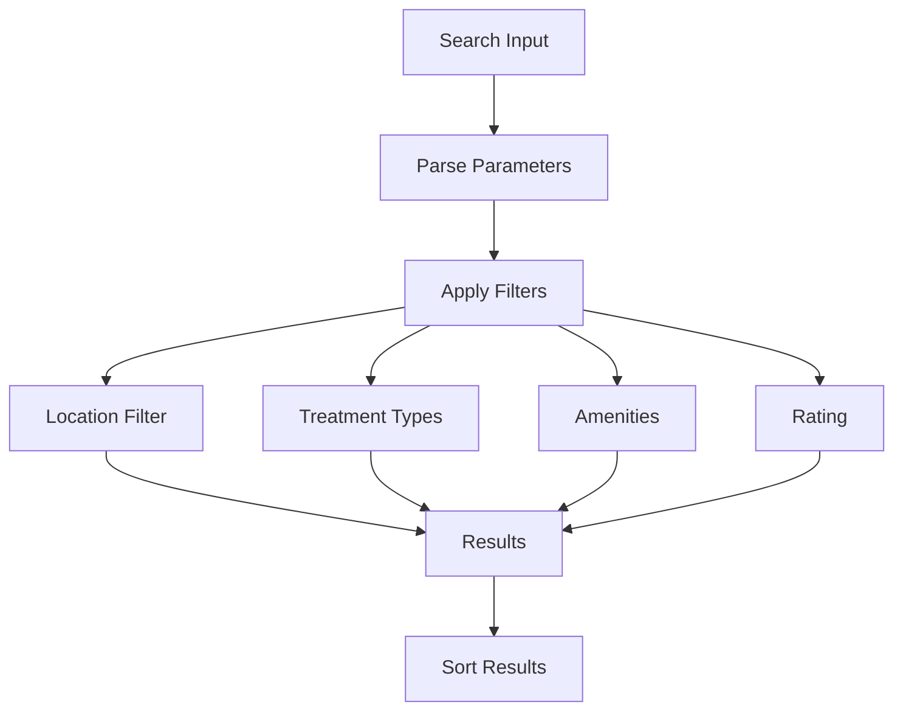
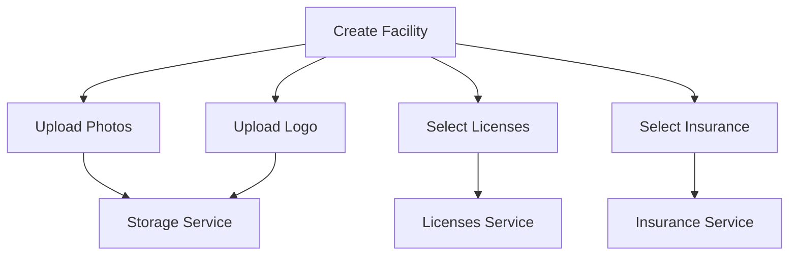
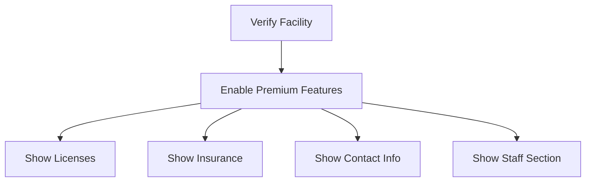

# Services Architecture Documentation

## Overview
The Recovery Directory platform uses a modular service architecture to handle different aspects of the application. This document details the main services and their interactions.

## Services Structure

### Facilities Service
Located in `src/services/facilities/`, split into modular components:

#### Core Modules
- `types.ts`: Core facility types and interfaces
- `utils.ts`: Data transformation and utility functions
- `crud.ts`: Basic CRUD operations
- `search.ts`: Search and filtering operations
- `moderation.ts`: Moderation-related operations
- `verification.ts`: Verification status operations
- `index.ts`: Unified export of all facility services

#### Key Features
- Facility CRUD operations
- Search and filtering
  - Location-based search (city, state)
  - Treatment type filtering
  - Amenities filtering
  - Rating filtering
  - Insurance filtering
  - Combined search capabilities
- Moderation workflow
- Verification status management
- Archived facilities management
- License and insurance integration
- Photo and logo management

#### Return Types
All facility-fetching methods now return direct arrays:
```typescript
// Get all active facilities (excludes archived)
const facilities: Facility[] = await facilitiesService.getFacilities();

// Get featured facilities (limited to 6)
const featured: Facility[] = await facilitiesService.getFeaturedFacilities();

// Get user's facilities
const userListings: Facility[] = await facilitiesService.getUserListings(userId);

// Search facilities
const searchResults: Facility[] = await facilitiesService.searchFacilities({
  query: 'rehab',
  location: ['Phoenix, AZ'],
  treatmentTypes: ['inpatient']
});
```

#### Archived Facilities
Archived facilities are handled separately:
```typescript
// Admin view - get all non-archived facilities
const active: Facility[] = await facilitiesService.getAllListingsForAdmin();

// Admin view - get archived facilities
const archived: Facility[] = await facilitiesService.getArchivedListings();

// Archive a facility
await facilitiesService.archiveFacility(facilityId);

// Note: Archived facilities are automatically excluded from:
// - Public search results
// - Featured facilities
// - Homepage listings
```

#### Example Usage
```typescript
import { facilitiesService } from '../services/facilities';

// Create facility
const { id } = await facilitiesService.createFacility({
  name: 'Recovery Center',
  description: 'Treatment facility',
  location: '123 Main St',
  city: 'Phoenix',
  state: 'AZ',
  // ... other fields
});

// Search facilities with location
const results = await facilitiesService.searchFacilities({
  query: searchText,
  location: ['Los Angeles, CA'],  // City, State format
  treatmentTypes: ['inpatient'],
  amenities: ['pool', 'gym'],
  insurance: ['medicare'],
  rating: 4
});

// Moderation actions
await facilitiesService.approveFacility(id);
await facilitiesService.rejectFacility(id);
await facilitiesService.archiveFacility(id);

// Verification actions
await facilitiesService.verifyFacility(id);
await facilitiesService.unverifyFacility(id);

// Feature actions
await facilitiesService.featureFacility(id);
await facilitiesService.unfeatureFacility(id);
```

#### Search Parameters
```typescript
interface SearchParams {
  query: string;           // General search text
  location?: string[];     // Array of "City, State" strings
  treatmentTypes?: string[];
  amenities?: string[];
  insurance?: string[];
  conditions?: string[];
  substances?: string[];
  therapies?: string[];
  languages?: string[];
  rating?: number | null;
}
```

### Users Service
Located in `src/services/users.ts`, handles user management:

#### Key Features
- User CRUD operations
- Role management
- Authentication integration
- Password reset functionality
- User statistics

```typescript
import { usersService } from '../services/users';

// Create user
const user = await usersService.createUser({
  email,
  role,
  createdAt
});

// Get user statistics
const stats = await usersService.getUserStats();
```

### Licenses Service
Located in `src/services/licenses.ts`, manages facility certifications:

#### Key Features
- License CRUD operations
- Integration with facility verification
- Admin management interface
- Logo management

```typescript
import { licensesService } from '../services/licenses';

// Get all licenses
const licenses = await licensesService.getLicenses();

// Add new license
const license = await licensesService.addLicense({
  name,
  description,
  logo
});
```

### Insurance Service
Located in `src/services/insurances.ts`, manages insurance providers:

#### Key Features
- Insurance provider CRUD operations
- Integration with facility profiles
- Logo management
- Admin management interface

```typescript
import { insurancesService } from '../services/insurances';

// Get all insurance providers
const providers = await insurancesService.getInsurances();

// Add new provider
const provider = await insurancesService.addInsurance({
  name,
  description,
  logo
});
```

### Network Service
Located in `src/services/network.ts`, handles online/offline functionality:

#### Key Features
- Network state management
- Offline mode handling
- Firestore enablement/disablement

```typescript
import { networkService } from '../services/network';

// Handle offline mode
await networkService.goOffline();

// Restore online functionality
await networkService.goOnline();
```

## Service Interactions

### Search Flow


### Facility Creation Flow


### Verification Flow


## Testing

### Unit Tests
```typescript
describe('facilitiesService', () => {
  it('creates facility with licenses', async () => {
    // Test facility creation with licenses
  });

  it('handles verification status changes', async () => {
    // Test verification flow
  });

  it('excludes archived facilities from search', async () => {
    const results = await facilitiesService.searchFacilities({
      query: ''
    });
    expect(results.every(f => f.moderationStatus !== 'archived')).toBe(true);
  });
});
```

### Integration Tests
```typescript
describe('Service Interactions', () => {
  it('handles facility verification flow', async () => {
    // Test complete verification flow
  });

  it('manages facility updates with licenses', async () => {
    // Test facility update flow
  });
});
```

## Best Practices

### Service Design
1. Modularity
   - Separate concerns
   - Clear interfaces
   - Minimal dependencies

2. Error Handling
   - Consistent error types
   - Proper error propagation
   - User-friendly messages
   - Logging

3. Type Safety
   - TypeScript interfaces
   - Runtime validation
   - Proper type conversions

### Data Management
1. Firestore Integration
   - Proper timestamp handling
   - Batch operations
   - Transaction safety
   - Data validation

2. Storage
   - File organization
   - Cleanup procedures
   - Access control
   - URL management

## Future Improvements
1. Enhanced search capabilities
   - Fuzzy matching
   - Relevance scoring
   - Search suggestions
2. Location improvements
   - Radius search
   - Map integration
   - Location autocomplete
3. Filter enhancements
   - Saved filters
   - Filter combinations
   - Custom filters
4. Performance optimization
   - Query caching
   - Partial results
   - Progressive loading
5. Analytics integration
   - Search patterns
   - Popular locations
   - Filter usage
