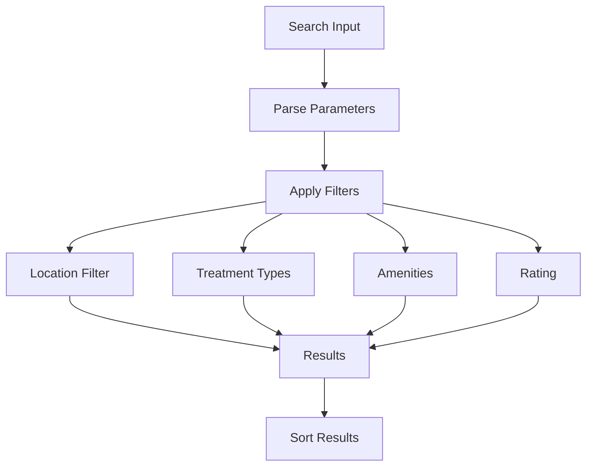
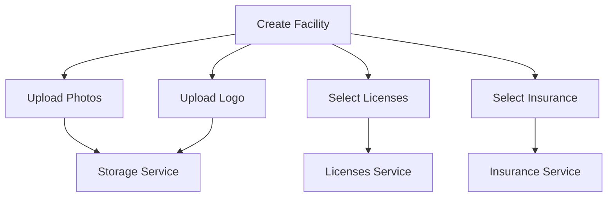
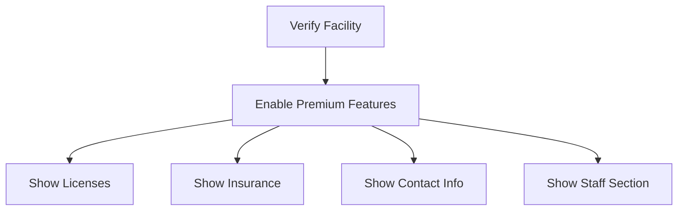

# Services Architecture Documentation

## Overview
The Recovery Directory platform uses a modular service architecture to handle different aspects of the application. This document details the main services and their interactions.

## Services Structure

### Facilities Service
Located in `src/services/facilities/`, split into modular components:

#### Core Modules
- `types.ts`: Core facility types and interfaces
- `utils.ts`: Data transformation and utility functions
- `crud.ts`: Basic CRUD operations
- `search.ts`: Search and filtering operations
- `moderation.ts`: Moderation-related operations
- `verification.ts`: Verification status operations
- `index.ts`: Unified export of all facility services

#### Key Features
- Facility CRUD operations
- Search and filtering
  - Location-based search (city, state)
  - Treatment type filtering
  - Amenities filtering
  - Rating filtering
  - Insurance filtering
  - Combined search capabilities
- Moderation workflow
- Verification status management
- License and insurance integration
- Photo and logo management
- Automated migrations
  - Slug generation for existing facilities
  - Data structure updates

#### Migration System
The facilities service includes an automated migration system to handle data structure updates:

##### Slug Migration
Ensures all facilities have URL-friendly slugs:
```typescript
// Run slug migration
await facilitiesService.migrateExistingSlugs();
```

This will:
1. Find all facilities without slugs
2. Generate slugs from facility names and locations
3. Update the facilities with new slugs
4. Handle duplicate slugs by appending unique identifiers

#### Example Usage
```typescript
import { facilitiesService } from '../services/facilities';

// Create facility
const { id } = await facilitiesService.createFacility(data);

// Search facilities with location
const results = await facilitiesService.searchFacilities({
  query: searchText,
  location: ['Los Angeles, CA'],  // City, State format
  treatmentTypes,
  amenities,
  insurance,
  rating
});

// Search with multiple filters
const filteredResults = await facilitiesService.searchFacilities({
  query: '',
  location: ['Phoenix, AZ', 'Tucson, AZ'],
  treatmentTypes: ['Inpatient', 'Outpatient'],
  amenities: ['Pool', 'Gym'],
  insurance: ['Medicare', 'Blue Cross'],
  rating: 4
});

// Run migrations if needed
await facilitiesService.migrateExistingSlugs();
```

#### Search Parameters
```typescript
interface SearchParams {
  query: string;           // General search text
  location?: string[];     // Array of "City, State" strings
  treatmentTypes: string[];
  amenities: string[];
  insurance: string[];
  rating: number | null;
}
```

### Users Service
Located in `src/services/users.ts`, handles user management:

#### Key Features
- User CRUD operations
- Role management
- Authentication integration
- Password reset functionality
- User statistics

```typescript
import { usersService } from '../services/users';

// Create user
const user = await usersService.createUser({
  email,
  role,
  createdAt
});

// Get user statistics
const stats = await usersService.getUserStats();
```

### Licenses Service
Located in `src/services/licenses.ts`, manages facility certifications:

#### Key Features
- License CRUD operations
- Integration with facility verification
- Admin management interface
- Logo management

```typescript
import { licensesService } from '../services/licenses';

// Get all licenses
const licenses = await licensesService.getLicenses();

// Add new license
const license = await licensesService.addLicense({
  name,
  description,
  logo
});
```

### Insurance Service
Located in `src/services/insurances.ts`, manages insurance providers:

#### Key Features
- Insurance provider CRUD operations
- Integration with facility profiles
- Logo management
- Admin management interface

```typescript
import { insurancesService } from '../services/insurances';

// Get all insurance providers
const providers = await insurancesService.getInsurances();

// Add new provider
const provider = await insurancesService.addInsurance({
  name,
  description,
  logo
});
```

### Network Service
Located in `src/services/network.ts`, handles online/offline functionality:

#### Key Features
- Network state management
- Offline mode handling
- Firestore enablement/disablement

```typescript
import { networkService } from '../services/network';

// Handle offline mode
await networkService.goOffline();

// Restore online functionality
await networkService.goOnline();
```

## Service Interactions

### Search Flow


### Facility Creation Flow


### Verification Flow


### Search Implementation
1. Filter Management
   - Clear filter interfaces
   - Efficient filtering
   - Proper type handling
   - Case-insensitive matching

2. Location Handling
   - City, State format
   - Case-insensitive matching
   - Multiple location support
   - Proper string parsing

3. Performance
   - Efficient filtering
   - Proper indexing
   - Result caching
   - Query optimization
## Testing

### Unit Tests
```typescript
describe('facilitiesService', () => {
  it('creates facility with licenses', async () => {
    // Test facility creation with licenses
  });

  it('handles verification status changes', async () => {
    // Test verification flow
  });

  it('migrates existing slugs correctly', async () => {
    await facilitiesService.migrateExistingSlugs();
    const facilities = await facilitiesService.getFacilities();
    expect(facilities.facilities.every(f => f.slug)).toBe(true);
  });

  it('handles duplicate slugs during migration', async () => {
    const facilities = await facilitiesService.getFacilities();
    const slugs = new Set(facilities.facilities.map(f => f.slug));
    expect(slugs.size).toBe(facilities.facilities.length);
  });
});

describe('licensesService', () => {
  it('manages licenses correctly', async () => {
    // Test license management
  });
});
```

### Search Tests
```typescript
describe('facilitiesService.search', () => {
  it('filters by location correctly', async () => {
    const results = await facilitiesService.searchFacilities({
      query: '',
      location: ['Phoenix, AZ']
    });
    expect(results.every(f => 
      f.city.toLowerCase() === 'phoenix' && 
      f.state.toLowerCase() === 'az'
    )).toBe(true);
  });

  it('combines multiple filters', async () => {
    const results = await facilitiesService.searchFacilities({
      location: ['Los Angeles, CA'],
      treatmentTypes: ['Inpatient'],
      rating: 4
    });
    // Test combined filters
  });
});
```

### Integration Tests
```typescript
describe('Service Interactions', () => {
  it('handles facility verification flow', async () => {
    // Test complete verification flow
  });

  it('manages facility updates with licenses', async () => {
    // Test facility update flow
  });
});
```

## Best Practices

### Service Design
1. Modularity
   - Separate concerns
   - Clear interfaces
   - Minimal dependencies

2. Error Handling
   - Consistent error types
   - Proper error propagation
   - User-friendly messages
   - Logging

3. Type Safety
   - TypeScript interfaces
   - Runtime validation
   - Proper type conversions

### Data Management
1. Firestore Integration
   - Proper timestamp handling
   - Batch operations
   - Transaction safety
   - Data validation

2. Storage
   - File organization
   - Cleanup procedures
   - Access control
   - URL management

### Migration Handling
1. Data Integrity
   - Backup before migration
   - Validate results
   - Handle errors gracefully

2. Performance
   - Batch updates
   - Progress tracking
   - Resumable operations

## Future Improvements
1. Enhanced caching
2. Offline support
3. Real-time updates
4. Better search optimization
5. Enhanced validation
6. Automated cleanup
7. Performance monitoring
8. Enhanced security
9. Better error handling
10. Documentation updates
11. Enhanced search capabilities
    - Fuzzy matching
    - Relevance scoring
    - Search suggestions
12. Location improvements
    - Radius search
    - Map integration
    - Location autocomplete
13. Filter enhancements
    - Saved filters
    - Filter combinations
    - Custom filters
14. Performance optimization
    - Query caching
    - Partial results
    - Progressive loading
15. Analytics integration
    - Search patterns
    - Popular locations
    - Filter usage
